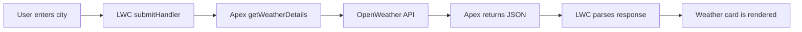

# LWC-Project-2-Weather-Application


<div align="center">

# 🌦️ Weather App

### <samp>Salesforce LWC · Apex Callout · OpenWeather API</samp>

<p>
  Search for a city and view its current temperature, weather condition,
  location, “feels like” temperature, and humidity directly inside a
  Salesforce Experience Cloud site.
  Weather application with client and server API integration

</p>

<p>
  
  
  
  
</p>

</div>

---

## <samp>01 — Overview</samp>

The Weather App is a Salesforce Lightning Web Component that accepts a city name, sends the request to an Apex controller, retrieves current weather data from the OpenWeather API, and presents the result in a responsive weather card.

The component is configured for Salesforce Experience Cloud pages.

> [!IMPORTANT]
> Never commit an active API key to a public repository. The current Apex implementation should be updated to use a secure credential-management approach before the repository is published.

---

## <samp>02 — What the App Displays</samp>

<table>
  <tr>
    <td><strong>🌡️ Temperature</strong></td>
    <td>Current city temperature in Celsius</td>
  </tr>
  <tr>
    <td><strong>☁️ Condition</strong></td>
    <td>Current weather description and matching icon</td>
  </tr>
  <tr>
    <td><strong>📍 Location</strong></td>
    <td>City and country code</td>
  </tr>
  <tr>
    <td><strong>🧥 Feels Like</strong></td>
    <td>Perceived temperature in Celsius</td>
  </tr>
  <tr>
    <td><strong>💧 Humidity</strong></td>
    <td>Current relative humidity percentage</td>
  </tr>
</table>

Additional behavior includes:

- Loading feedback while weather data is being retrieved
- Error feedback for invalid city names or failed callouts
- Dynamic weather icons based on OpenWeather condition codes
- A back action that clears the result and returns to city search
- Responsive card-based styling
- Experience Cloud page support

---

## <samp>03 — Application Flow</samp>



### Request lifecycle

```text
City Search
    ↓
weatherApp.js
    ↓
weatherAppController.cls
    ↓
OpenWeather Current Weather API
    ↓
JSON Response
    ↓
Temperature, condition, location, feels-like value, and humidity
```

---

## <samp>04 — Technology Map</samp>

| Layer | Technology | Responsibility |
|---|---|---|
| Presentation | Lightning Web Components | Search form, loading state, errors, and weather result |
| Styling | CSS and SLDS utilities | Layout, card appearance, typography, and responsive alignment |
| Server | Salesforce Apex | Performs the external HTTP GET callout |
| Data Provider | OpenWeather API | Supplies current weather information |
| Assets | Salesforce Static Resource | Stores weather, location, humidity, and navigation icons |
| Hosting | Salesforce Experience Cloud | Makes the component available on community pages |

---

## <samp>05 — Repository Layout</samp>

```text
force-app/
└── main/
    └── default/
        ├── classes/
        │   ├── weatherAppController.cls
        │   └── weatherAppController.cls-meta.xml
        │
        ├── lwc/
        │   └── weatherApp/
        │       ├── weatherApp.html
        │       ├── weatherApp.js
        │       ├── weatherApp.css
        │       └── weatherApp.js-meta.xml
        │
        └── staticresources/
            ├── weatherAppIcons.resource-meta.xml
            └── weatherAppIcons.zip
```

### Component files

<details>
<summary><strong>weatherApp.html</strong></summary>

Defines:

- City search form
- Loading and error messages
- Weather icon and temperature result
- City and country display
- Feels-like temperature
- Humidity
- Back navigation

</details>

<details>
<summary><strong>weatherApp.js</strong></summary>

Handles:

- City input
- Form submission
- Apex method invocation
- JSON parsing
- Weather condition mapping
- Dynamic icon selection
- Result and error state
- Search reset

</details>

<details>
<summary><strong>weatherApp.css</strong></summary>

Controls:

- Full-screen navy background
- Centered white weather card
- Search input and button styling
- Success and error notifications
- Temperature typography
- Footer metric layout
- Weather icon sizing

</details>

<details>
<summary><strong>weatherAppController.cls</strong></summary>

Performs the server-side HTTP GET callout to the current-weather endpoint and returns the response body to the LWC.

</details>

---

## <samp>06 — Prerequisites</samp>

Before deployment, prepare the following:

- A Salesforce org with Lightning Experience
- Experience Cloud enabled
- Salesforce CLI
- Visual Studio Code with Salesforce extensions
- A Salesforce DX project
- An OpenWeather account and API key
- Permission to deploy Apex, LWC, and Static Resources
- A secure mechanism for storing the API credential

---

## <samp>07 — Secure API Configuration</samp>

### ⚠️ Rotate any exposed API key

An API key that has already been committed, shared, or uploaded should be considered exposed.

1. Revoke or rotate the existing key in the OpenWeather account.
2. Remove the hardcoded key from the Apex source.
3. Store the replacement credential securely.
4. Review the Git history before making the repository public.

### Recommended approach: Named Credential

For a production-ready implementation, use a Salesforce Named Credential or External Credential rather than appending the key directly in Apex.

A conceptual Apex endpoint would look like:

```apex
req.setEndpoint(
    'callout:OpenWeather/data/2.5/weather?q=' +
    EncodingUtil.urlEncode(input, 'UTF-8') +
    '&units=metric'
);
```

The exact credential configuration depends on how the OpenWeather API key is passed.

> [!NOTE]
> A Custom Label is convenient for configuration but is not a secure secret store. Prefer Named Credentials, External Credentials, or another approved protected-secret mechanism.

### Development-only alternative

When using the current direct URL implementation, add the following host to Salesforce Remote Site Settings:

```text
https://api.openweathermap.org
```

Navigate to:

```text
Setup → Security → Remote Site Settings → New Remote Site
```

---

## <samp>08 — Static Resource Setup</samp>

The JavaScript imports a Static Resource named:

```text
weatherAppIcons
```

The expected archive structure is:

```text
weatherAppIcons/
├── arrow-back.svg
├── clear.svg
├── cloud.svg
├── droplet.svg
├── haze.svg
├── map.svg
├── rain.svg
├── snow.svg
├── storm.svg
└── thermometer.svg
```

Create a ZIP file that preserves this folder structure and upload it as a Salesforce Static Resource named `weatherAppIcons`.

The component resolves assets using paths such as:

```javascript
WEATHER_ICONS + '/weatherAppIcons/clear.svg'
```

---

## <samp>09 — Installation</samp>

### Clone the repository

```bash
git clone https://github.com/your-username/salesforce-weather-app.git
cd salesforce-weather-app
```

### Authenticate the target Salesforce org

```bash
sf org login web --alias WeatherAppOrg
```

### Deploy the Apex controller

```bash
sf project deploy start \
  --source-dir force-app/main/default/classes/weatherAppController.cls \
  --target-org WeatherAppOrg
```

### Deploy the LWC

```bash
sf project deploy start \
  --source-dir force-app/main/default/lwc/weatherApp \
  --target-org WeatherAppOrg
```

### Deploy the icon Static Resource

```bash
sf project deploy start \
  --source-dir force-app/main/default/staticresources \
  --target-org WeatherAppOrg
```

### Deploy all project metadata

```bash
sf project deploy start \
  --source-dir force-app/main/default \
  --target-org WeatherAppOrg
```

---

## <samp>10 — Add to Experience Cloud</samp>

The component metadata currently exposes the LWC to:

```xml
<target>lightningCommunity__Page</target>
<target>lightningCommunity__Default</target>
```

To place the component on a site:

1. Open **Setup**.
2. Navigate to **Digital Experiences → All Sites**.
3. Open the required site in **Experience Builder**.
4. Locate **Weather App** under custom components.
5. Drag the component onto the page.
6. Publish the site.

---

## <samp>11 — Weather Icon Rules</samp>

The LWC chooses an icon based on the condition ID returned by OpenWeather.

| Condition ID | Displayed Icon |
|---|---|
| `800` | Clear |
| `200–232` | Storm |
| `300–321` | Rain |
| `500–531` | Rain |
| `600–622` | Storm in the current implementation |
| `701–781` | Haze |
| `801–804` | Cloud |

> [!TIP]
> A dedicated snow icon is included in the Static Resource but is not currently selected for condition IDs `600–622`. Map that range to `snowIcon` when separate snow imagery is desired.

---

## <samp>12 — Usage</samp>

```text
1. Open the Experience Cloud page.
2. Enter a city name.
3. Select Search.
4. Wait for the API response.
5. Review the weather details.
6. Select the back arrow to search again.
```

Example:

```text
Input:
Austin

Output:
Temperature: 31°C
Condition: Clear sky
Location: Austin, US
Feels like: 33°C
Humidity: 48%
```

Actual values depend on the live API response.

---

## <samp>13 — Error Handling</samp>

| Scenario | Current behavior |
|---|---|
| Request is in progress | Shows “Fetching weather details...” |
| Invalid city name | Shows a city validation message |
| Apex or callout failure | Shows “Something went wrong” |
| Successful request | Clears the loading message and displays the weather card |
| Back action | Clears city, result, icon, and error state |

---

## <samp>14 — Recommended Improvements</samp>

- Replace the hardcoded API key with a Named Credential
- URL-encode the city input before adding it to the endpoint
- Add an Apex test class using `HttpCalloutMock`
- Add Jest tests for the LWC
- Handle numeric and string API error codes consistently
- Map snow condition codes to the included snow icon
- Handle API status codes beyond `404`
- Disable the Search button during an active request
- Trim empty spaces from city input
- Add geolocation-based weather lookup
- Add Fahrenheit and Celsius selection
- Display sunrise, sunset, wind speed, and visibility
- Add accessible live-region announcements for errors and loading states
- Remove development `console.log` statements
- Introduce reusable constants for condition-code ranges

---

## <samp>15 — Testing Checklist</samp>

Use the following scenarios before release:

```text
[ ] Valid city returns a weather result
[ ] Invalid city displays an error
[ ] Network or callout failure displays a generic error
[ ] Clear conditions display the clear icon
[ ] Rain conditions display the rain icon
[ ] Cloud conditions display the cloud icon
[ ] Haze conditions display the haze icon
[ ] Back arrow resets the application
[ ] Component renders correctly on mobile
[ ] Guest users have the required Apex class access
[ ] API credential is not present in source control
```

### Experience Cloud permissions

For guest or authenticated Experience Cloud users, verify:

- Apex class access to `weatherAppController`
- Component visibility
- Site CSP and callout configuration
- Required profile or permission-set assignments

---

## <samp>16 — Screenshot</samp>

Create an `assets` folder in the repository and add an application image:

```text
assets/
└── weather-app-preview.png
```

Then display it in this README:

```markdown

```

---

## <samp>17 — Disclaimer</samp>

Weather information is supplied by a third-party API and may be delayed, incomplete, or unavailable. This project is intended for Salesforce learning, demonstration, and portfolio use.

---

## <samp>18 — Author</samp>

<div align="center">

### **Kaushik**

<samp>Salesforce Developer</samp>


</div>
